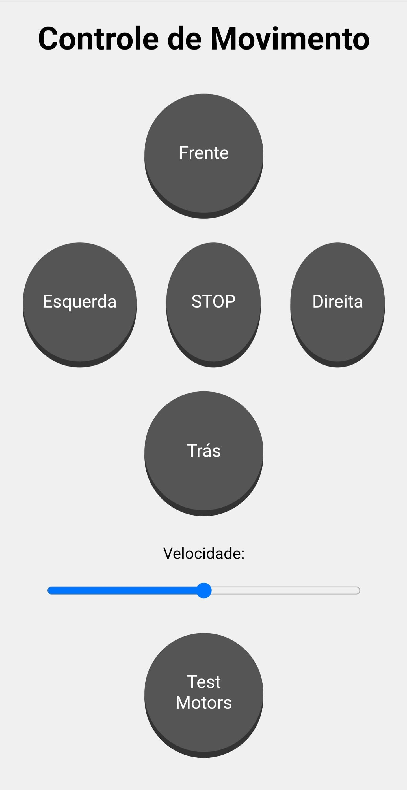

# esp8266-wifi-car
This repository is available in: 🇺🇸 [English](README.md)  
Este repositório está disponível em: 🇧🇷 [Português](README.pt.md)  

# 🚗 Wi-Fi Controlled Car with ESP8266 (Wemos D1 R1)
This project uses an ESP8266 (Wemos D1 R1) to control a small car over Wi-Fi. The control is done directly through a web browser by accessing the IP address of the ESP. With a simple interface, the user can steer the car, control motor speed, and run a motor test.

## 🔧 Features
- Direction control: forward, backward, left, and right.
- Adjustable motor speed.
- Test button to check motor functionality.
- Web interface accessible via the ESP8266's IP address.

## 🧰 Requirements
- Wemos D1 R1 (ESP8266) board
- Motor driver module (e.g., L298N)
- Two DC motors
- Power supply (battery or external source)
- Wires and breadboard (or soldered setup)

## 🌐 How to Use
- Chenage the SSID and Password in the code.
- Upload the code to the Wemos D1 R1 using the Arduino IDE.
- Connect the motors and the motor driver to the WemosD1R1.
- Power the ESP8266 and check the assigned IP address (via Serial Monitor).
- Access the IP through a web browser on a device connected to the same network.
- Use the interface to control the car in real-time.

## 💡 Notes
The car must be connected to the same Wi-Fi network as the controlling device (e.g., smartphone or PC).

The code can be easily modified to add sensors or a virtual joystick.

## 📸 Images

### Interface Web no Navegador

## 📜 License

This project is licensed under the **Creative Commons Attribution-NonCommercial 4.0 International (CC BY-NC 4.0)**.
>For commercial use, please contact me for licensing.

You are free to:
- Use, copy, and modify the project for **personal and non-commercial** purposes.
- Share it with attribution.

You may not:
- Use this work for commercial purposes (including resale or integration into paid products or services).

More info: [https://creativecommons.org/licenses/by-nc/4.0/](https://creativecommons.org/licenses/by-nc/4.0/)

